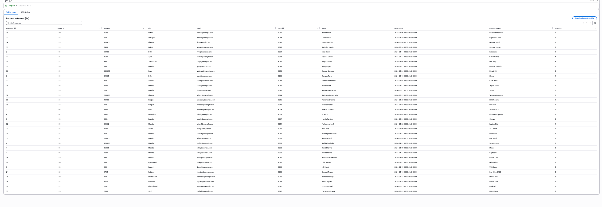

# Pipeline 1 — Expected Output (Simple)

| order_date                  | amount  | quantity | city        | item_id | name                 | customer_id | order_id | product_name         | email                |
|-----------------------------|---------|----------|-------------|---------|-----------------------|-------------|----------|-----------------------|----------------------|
| 2024-03-06 18:30:00.0+0000 | 750.9   | 1        | Patna       | 9021    | Ishan Kishan          | 19          | 120      | Bluetooth Earbuds     | kishan@example.com   |
| 2024-03-19 18:30:00.0+0000 | 650     | 1        | Srinagar    | 9029    | Umran Malik           | 27          | 128      | Keyboard Cover        | umran@example.com    |
| 2024-02-24 18:30:00.0+0000 | 1999.99 | 1        | Chennai     | 9016    | Dinesh Karthik        | 14          | 115      | Laptop Stand          | dk@example.com       |
| 2024-02-14 18:30:00.0+0000 | 3400    | 2        | Rajkot      | 9013    | Ravindra Jadeja       | 11          | 112      | Gaming Mouse          | jadeja@example.com   |
| 2024-01-14 18:30:00.0+0000 | 999.99  | 1        | Delhi       | 9004    | Virat Kohli           | 2           | 103      | Earphones             | virat@example.com    |
| 2024-03-11 18:30:00.0+0000 | 1500    | 4        | Agra        | 9024    | Deepak Chahar         | 22          | 123      | Water Bottle          | chahar@example.com   |
| 2024-03-08 18:30:00.0+0000 | 880     | 3        | Trivandrum  | 9022    | Sanju Samson          | 20          | 121      | LED Strip             | sanju@example.com    |
| 2024-02-21 18:30:00.0+0000 | 890     | 1        | Mumbai      | 9015    | Shreyas Iyer          | 13          | 114      | Monitor 24-inch       | iyer@example.com     |
| 2024-03-24 18:30:00.0+0000 | 1250.75 | 2        | Pune        | 9032    | Ruturaj Gaikwad       | 30          | 131      | Ring Light            | gaikwad@example.com  |
| 2024-02-10 18:30:00.0+0000 | 1450.5  | 1        | Delhi       | 9010    | Rishabh Pant          | 8           | 109      | Shoes                 | pant@example.com     |
| 2024-03-04 18:30:00.0+0000 | 120     | 1        | Amroha      | 9019    | Mohammed Shami        | 17          | 118      | RAM 16GB              | shami@example.com    |
| 2024-03-17 18:30:00.0+0000 | 2200    | 1        | Mumbai      | 9027    | Prithvi Shaw          | 25          | 126      | Tripod Stand          | shaw@example.com     |
| 2024-02-11 18:30:00.0+0000 | 760     | 3        | Mumbai      | 9011    | Suryakumar Yadav      | 9           | 110      | T-Shirt               | sky@example.com      |
| 2024-02-19 18:30:00.0+0000 | 2500.75 | 1        | Chennai     | 9014    | Ravichandran Ashwin   | 12          | 113      | Wireless Keyboard     | ashwin@example.com   |
| 2024-03-29 18:30:00.0+0000 | 499.99  | 1        | Punjab      | 9035    | Abhishek Sharma       | 33          | 134      | HD Webcam             | abhishek@example.com |
| 2024-03-02 18:30:00.0+0000 | 320     | 1        | Kanpur      | 9018    | Kuldeep Yadav         | 16          | 117      | SSD 1TB               | kuldeep@example.com  |
| 2024-02-09 18:30:00.0+0000 | 2300    | 1        | Delhi       | 9009    | Shikhar Dhawan        | 7           | 108      | Smartwatch            | dhawan@example.com   |
| 2024-02-05 18:30:00.0+0000 | 890.2   | 1        | Mangalore   | 9008    | KL Rahul              | 6           | 107      | Bluetooth Speaker     | rahul@example.com    |
| 2024-02-04 18:30:00.0+0000 | 550.4   | 2        | Baroda      | 9007    | Hardik Pandya         | 5           | 106      | Charger               | hardik@example.com   |
| 2024-03-28 18:30:00.0+0000 | 1900.2  | 1        | Mumbai      | 9034    | Yashasvi Jaiswal      | 32          | 133      | Laptop Skin           | jaiswal@example.com  |
| 2024-03-09 18:30:00.0+0000 | 4000    | 1        | Anand       | 9023    | Axar Patel            | 21          | 122      | AC Cooler             | axar@example.com     |
| 2024-03-13 18:30:00.0+0000 | 350     | 5        | Chennai     | 9025    | Washington Sundar     | 23          | 124      | Notebook              | sundar@example.com   |
| 2024-03-26 18:30:00.0+0000 | 3300.55 | 1        | Mohali      | 9033    | Shubman Gill          | 31          | 132      | Mic Stand             | gill@example.com     |
| 2024-01-31 18:30:00.0+0000 | 1200.75 | 1        | Mumbai      | 9006    | Sachin Tendulkar      | 4           | 105      | Smartphone            | sachin@example.com   |
| 2024-01-09 18:30:00.0+0000 | 1500.5  | 2        | Mumbai      | 9002    | Rohit Sharma          | 1           | 101      | Mouse                 | rohit@example.com    |
| 2024-01-11 18:30:00.0+0000 | 2000    | 1        | Mumbai      | 9003    | Rohit Sharma          | 1           | 102      | Keyboard              | rohit@example.com    |
| 2024-03-05 18:30:00.0+0000 | 660     | 2        | Meerut      | 9020    | Bhuvneshwar Kumar     | 18          | 119      | Phone Case            | bhuvi@example.com    |
| 2024-03-22 18:30:00.0+0000 | 980     | 1        | Hyderabad   | 9031    | Tilak Varma           | 29          | 130      | Office Chair          | tilak@example.com    |
| 2024-01-19 18:30:00.0+0000 | 500     | 3        | Ranchi      | 9005    | MS Dhoni              | 3           | 104      | USB Cable             | dhoni@example.com    |
| 2024-03-16 18:30:00.0+0000 | 975.5   | 2        | Palghar     | 9026    | Shardul Thakur        | 24          | 125      | Pen Drive 64GB        | shardul@example.com  |
| 2024-03-21 18:30:00.0+0000 | 420     | 3        | Chandigarh  | 9030    | Arshdeep Singh        | 28          | 129      | Mouse Pad             | arshdeep@example.com |
| 2024-03-18 18:30:00.0+0000 | 1150    | 2        | Lucknow     | 9028    | Rahul Tripathi        | 26          | 127      | Power Bank            | tripathi@example.com |
| 2024-02-13 18:30:00.0+0000 | 510.5   | 1        | Ahmedabad   | 9012    | Jasprit Bumrah        | 10          | 111      | Backpack              | bumrah@example.com   |
| 2024-02-29 18:30:00.0+0000 | 780.8   | 2        | Jind        | 9017    | Yuzvendra Chahal      | 15          | 116      | HDMI Cable            | chahal@example.com   |

## What the pipeline produces
The pipeline joins:
- customers
- orders
- order_items

and creates **one flat table** where **each row = one item from one order**.

## Where the result goes
The final joined data is written to:
- Keyspace: `cassandra_db`
- Table: `sales_data`

## Why customer_id/order_id repeat
This is expected:
- If an order has multiple items → multiple rows
- Cassandra stores data item-wise, not order-wise.

## What each row contains
- customer info (id, name, email, city)
- order info (order_id, date, amount)
- item info (item_id, product_name, quantity)

## Example
One order with 2 items → 2 rows.

## Final result
You should see ~34 rows in Keyspaces, each representing one purchased item.

