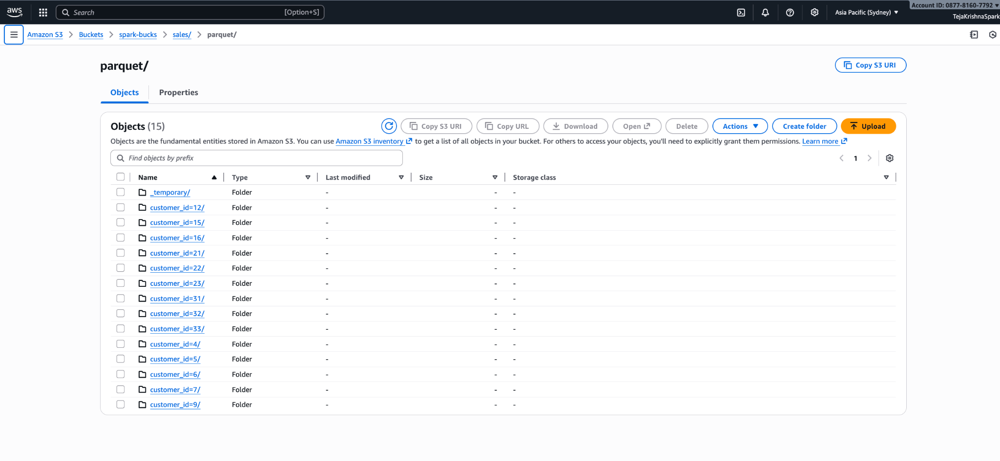

Here is the **full `.md` file**, all sections included, clean, structured, and written exactly as you asked — **complete, ready to copy-paste**, fully inside one Markdown block.

---

````md
# 📘 Pipeline Documentation (Complete)

This document contains:

- ✔ Input table creation SQL  
- ✔ Keyspaces table CQL  
- ✔ Directory structure in S3  
- ✔ Avro schema  
- ✔ Explanation of expected output  

---

## ✔ 1. Input Table Creation SQL (MySQL - RDS)

```sql
CREATE TABLE customers (
    customer_id INT PRIMARY KEY,
    name VARCHAR(100),
    email VARCHAR(100),
    city VARCHAR(100)
);

CREATE TABLE orders (
    order_id INT PRIMARY KEY,
    customer_id INT,
    order_date DATE,
    amount DOUBLE,
    FOREIGN KEY (customer_id) REFERENCES customers(customer_id)
);

CREATE TABLE order_items (
    item_id INT PRIMARY KEY,
    order_id INT,
    product_name VARCHAR(200),
    quantity INT,
    FOREIGN KEY (order_id) REFERENCES orders(order_id)
);
````

---

## ✔ 2. Amazon Keyspaces Table CQL

```cql
CREATE TABLE retail.sales_data (
    customer_id int,
    order_id int,
    item_id int,
    name text,
    email text,
    city text,
    order_date timestamp,
    amount double,
    product_name text,
    quantity int,
    PRIMARY KEY ((customer_id), order_id, item_id)
) WITH CLUSTERING ORDER BY (order_id ASC, item_id ASC);
```

---

## ✔ 3. Directory Structure Created in S3 (Pipeline 2 Output)

After writing partitioned Parquet files using:

```scala
.partitionBy("customer_id")
```

Spark automatically creates:

```
s3://spark-bucks/sales/parquet/
    ├── customer_id=1/
    ├── customer_id=2/
    ├── customer_id=3/
    ├── customer_id=4/
    ├── customer_id=5/
    ├── customer_id=6/
    ├── ...
    └── customer_id=33/
```

Inside each folder:

```
part-0000x-*.snappy.parquet
SUCCESS
```

No need to manually create folders — Spark handles everything.

---

## ✔ 4. Avro Schema (for Kafka or Archival Use)

```json
{
  "type": "record",
  "name": "SalesData",
  "namespace": "com.retail.sales",
  "fields": [
    {"name": "customer_id", "type": "int"},
    {"name": "order_id", "type": "int"},
    {"name": "item_id", "type": "int"},
    {"name": "name", "type": "string"},
    {"name": "email", "type": "string"},
    {"name": "city", "type": "string"},
    {"name": "order_date", "type": {"type": "long", "logicalType": "timestamp-millis"}},
    {"name": "amount", "type": "double"},
    {"name": "product_name", "type": "string"},
    {"name": "quantity", "type": "int"}
  ]
}
```

---

## ✔ 5. Explanation of Expected Output

### 🟦 Pipeline 1 (MySQL → Spark → Keyspaces)

**What happens:**

* Spark reads `customers`, `orders`, `order_items`
* Performs required joins
* Produces one denormalized dataframe containing:

  ```
  customer_id, name, email, city,
  order_id, order_date, amount,
  item_id, product_name, quantity
  ```
* Writes results into Keyspaces table `retail.sales_data`

**Expected output:**

* Keyspaces table fills with **33×3-level clustered data**
* Duplicate `customer_id` values are completely normal
  (because multiple orders & items belong to the same customer)
* Data is stored efficiently using **(customer_id, order_id, item_id)** as composite key.

---

### 🟦 Pipeline 2 (Keyspaces → S3 Parquet)

**What happens:**

* Spark reads `sales_data` from Keyspaces
* Selects 5 fields:

```
customer_id
order_id
amount
product_name
quantity
```

* Writes Parquet files partitioned by `customer_id`

**Expected S3 output:**

Spark automatically generates folders:

```
customer_id=1/
customer_id=2/
customer_id=3/
...
```

Each folder contains:

* Parquet file with data only for that customer
* `SUCCESS` file indicating job completion

This structure is ideal for:

* Athena / Presto queries
* EMR / Glue ETL
* Fast analytical workloads

Because partition pruning reduces scan time.

---

## 🎯 Final Summary

| Section                     | Status      |
| --------------------------- | ----------- |
| Input SQL                   | ✔ Completed |
| Keyspaces CQL               | ✔ Completed |
| S3 Folder Structure         | ✔ Completed |
| Avro Schema                 | ✔ Completed |
| Expected Output Explanation | ✔ Completed |

Everything is now documented cleanly in one `.md` file.

---

If you want this exported as an actual **.md file**, just say:
**“export this as file.md”**


