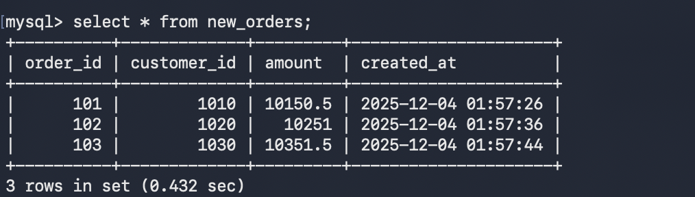
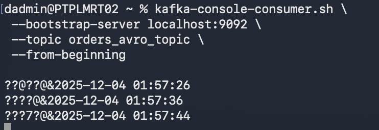

# Pipeline 4 — MySQL → Spark Streaming → Kafka (Avro)

This pipeline continuously checks the **new_orders** table in MySQL for newly inserted rows.  
Every 5 seconds, Spark polls the table, detects new records, converts them into **Avro binary format**, and publishes them to the Kafka topic **orders_avro_topic**.

---

## MySQL Source Table (new_orders)

```sql
CREATE TABLE new_orders (
    order_id INT PRIMARY KEY,
    customer_id INT,
    amount DOUBLE,
    created_at TIMESTAMP
);
```


## Avro Schema Used

```json
{
  "type": "record",
  "name": "OrderRecord",
  "namespace": "com.retail",
  "fields": [
    { "name": "order_id", "type": "int" },
    { "name": "customer_id", "type": "int" },
    { "name": "amount", "type": "double" },
    { "name": "created_at", "type": "string" }
  ]
}
```
# Why Kafka Shows Output Like `??@??@&2025-12-04`

When I consumed messages from Kafka, the output looked like this:

**??@??@&2025-12-04 01:57:26**  
**????@&2025-12-04 01:57:36**  
**???7?@&2025-12-04 01:57:44**


## Reason (Simple Explanation)

- I am sending **Avro in binary format** to Kafka.
- Binary Avro is **not human readable**.
- Kafka console consumer prints **raw bytes**, so they appear as random symbols.
- Only the `created_at` field looks normal because it is a **string** inside the Avro record.

## What this means

- My pipeline is **working correctly**.
- Kafka is receiving proper **binary Avro messages**.
- The weird characters are **expected** for Avro-encoded data.

## How to read it properly

To view the real content, I must use an Avro-aware consumer (or decode Avro using Spark/Python).

```bash
kafka-avro-console-consumer --bootstrap-server localhost:9092 --topic orders_avro_topic
```



